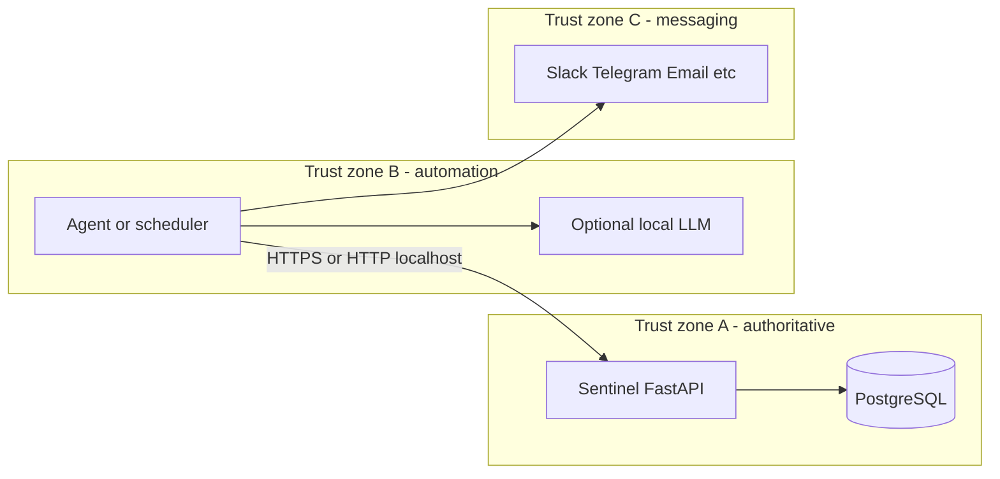

# Product Requirements Document: SENTINEL V2
## Automation, External Orchestration & Hardened Operations

**Version**: 2.0.0 (draft — next meaningful upgrade after PoC)  
**Date**: 2026-04-16  
**Supersedes for scope**: PoC requirements in [`SENTINEL_PRD.md`](SENTINEL_PRD.md) remain the baseline for shipped features; this document defines the **V2 program** for automation, agent integration, and **security hardening**.

---

## 1. Purpose & Delta from PoC

The PoC delivers a **local-first** FastAPI + React application: BOM ingest, enrichment, multi-dimensional risk scoring, what-if scenarios, exports, and optional intelligence narrative (rules + LLM). It assumes a **trusted single operator** on one machine.

**V2** adds a deliberate **operations and integration layer**: scheduled jobs, digest reporting, optional **external agent frameworks** (e.g. CLI/TUI agents that call HTTP APIs, run tools, and connect to messaging platforms), and **first-class security** so Sentinel can be used safely when automation bridges **localhost APIs** to **broader networks** (LAN, messaging, cloud LLMs).

V2 does **not** require a specific vendor agent; reference implementations may cite [Hermes Agent](https://hermes-agent.nousresearch.com/docs/getting-started/quickstart) as one option that supports custom OpenAI-compatible endpoints, scheduling, and messaging gateways.

---

## 2. Goals

| Goal | Description |
|------|-------------|
| **G1 — Secure by configuration** | Deployments can enforce authentication, least-privilege API access, auditable automation, and safe network binding without forking the codebase. |
| **G2 — Stable machine contract** | Versioned, documented JSON surfaces for “digest” and automation (risk summaries, at-risk lines, export payloads) so orchestrators do not scrape the UI. |
| **G3 — Separation of concerns** | Sentinel remains the **domain authority** (data, scoring, enrichment orchestration); external agents handle **scheduling, summarization tone, and notification routing** unless/until specific flows are inlined. |
| **G4 — Trust boundaries** | Clear rules when LLMs may **narrate** vs **must not invent** procurement, inventory, or pricing facts (aligned with existing Tier B/C intelligence policy). |

### 2.1 Non-Goals (V2)

- Full **ERP/PLM** replacement or native multi-tenant SaaS (may remain future work).
- Mandating a single agent product; **cron + scripts** remains a supported pattern for regulated environments.
- Complete **BOM billing / commercial pricing engine** — captured as research and posterboard items in [`thoughts.md`](thoughts.md), not committed scope here.

---

## 3. Reference Architecture

- **Zone A**: Stores BOMs, scores, audit trails; all numeric and structured outputs are **source of truth**.
- **Zone B**: Runs on an operator-approved host; holds automation credentials **for Sentinel** and **for messaging** separately where possible.
- **Zone C**: Untrusted for secrets; receives **redacted digests** appropriate to channel policy.

---

## 4. Security Requirements (V2 Core)

This section is the **primary deliverable** of the V2 program relative to the PoC.

### 4.1 Threat Model (Assumptions)

| Scenario | Risk | V2 expectation |
|----------|------|----------------|
| Single user, API only on `127.0.0.1`, no automation | Low | Optional hardening (off by default) to preserve dev UX. |
| API reachable on **LAN** | Medium | Authentication **required**; TLS recommended at reverse proxy. |
| **Agent + messaging** (e.g. Telegram, Slack) on same host | Medium–High | Treat messaging as **public channel**; no raw BOM secrets in notifications by default; **scoped tokens** for API. |
| Agent compromised | High | **Least privilege** tokens, read-only automation role, short-lived credentials where feasible. |
| LLM prompt injection via digests | Medium | Structured JSON inputs; system prompts forbid fabricating distributor quantities; **audit** LLM calls (existing `llm_audit_logs` pattern extended as needed). |

### 4.2 Authentication & Authorization

- **API keys or bearer tokens** (design choice: long-lived API keys with rotation, or JWTs issued by a future auth service — document selected mechanism in implementation).
- **Scoped access** at minimum:
  - `read:reports` — GET risk summaries, exports, read-only BOM views.
  - `write:enrichment` — POST enrichment triggers.
  - `write:ingest` — BOM upload / mutation (higher risk; optional separate key).
- **Default deny**: Unauthenticated access disabled when `SENTINEL_REQUIRE_AUTH=true` (or equivalent) in production profiles.
- **Automation identity**: Distinct keys for “scheduled digest bot” vs “human operator UI session” (future) so revocation is granular.

### 4.3 Network & Transport

- **Bind address**: Configurable `HOST` (e.g. `127.0.0.1` only vs `0.0.0.0`). PoC default may remain loopback-friendly; **production checklist** mandates explicit choice.
- **TLS**: Terminate TLS at **reverse proxy** (nginx, Caddy, Traefik) for non-localhost; avoid ad-hoc self-signed inside app unless documented.
- **CORS**: Restrict origins when UI is served from known hosts; avoid `*` with credentials.

### 4.4 Secrets & Configuration

- No secrets in repository; continue **env-only** pattern ([`backend/sentinel/config.py`](backend/sentinel/config.py)).
- **Rotation**: Document rotation for DB URLs, enrichment API keys, LLM keys, and **new** Sentinel API tokens.
- **Agent storage**: Discourage storing Sentinel API tokens in world-readable shell history; prefer OS keychain or restricted config files (documented in ops runbook).

### 4.5 Audit & Observability

- Extend structured logging for **authenticated API access** (actor id / key id, route, outcome) without logging full BOM payloads.
- Retain and extend **LLM audit** trails for any server-side narrative calls.
- Optional **webhook delivery logs** if outbound notifications are first-class.

### 4.6 Data Minimization for Notifications

- Digests sent to messaging channels must apply **Tier-appropriate redaction** (consistent with intelligence policy): program names, customer identifiers, and sensitive quantities may be masked unless explicitly allowed by policy flag.
- **LLM-generated text** in notifications should be labeled as **summary** when sourced from model; numeric facts must trace to Sentinel JSON fields.

### 4.7 Dependency & Supply Chain

- Pin Python and npm dependencies; periodic vulnerability review for FastAPI, Starlette, httpx, and frontend toolchain.
- For third-party agent runtimes: treat as **external software** with its own update cadence; do not bundle inside Sentinel core.

---

## 5. Functional Scope (V2)

### 5.1 Automation-Friendly API Surfaces

- **Stable JSON digest** endpoint(s), e.g. procurement-oriented summary: top-N at-risk lines, suggested review flags, links to internal report IDs (no UI scraping).
- **Export alignment**: Machine-readable parity with [`GET /api/export/risk-report/{bom_id}`](backend/sentinel/export/router.py) where applicable.
- **API versioning** prefix or `Accept-Version` strategy — decision recorded before breaking changes.

### 5.2 Optional Eventing

- **Webhooks** (outbound POST on score threshold or schedule completion) — optional; secured with HMAC signatures and replay protection.
- **Job queue** (Redis/RQ, ARQ, or lightweight in-DB jobs) — only if cron + HTTP proves insufficient at scale.

### 5.3 External Orchestration (Non-Normative)

- Schedulers or agents call Sentinel over HTTP using **scoped tokens**.
- Local LLMs (e.g. via OpenAI-compatible servers) may summarize **already-fetched JSON**; minimum context sizes for heavy multi-tool agents are an **operational constraint** (many agent frameworks recommend large context windows for long tool loops).

### 5.4 Relationship to BOM Billing

Commercial **BOM billing** (availability-weighted cost, build-plan tie-in, distributor pricing) is **not** committed in V2 scope; ideas and sketches live in [`thoughts.md`](thoughts.md). V2 security and digest APIs should not preclude later billing modules.

---

## 6. Phased Delivery

| Phase | Focus |
|-------|--------|
| **V2.0-S** | Auth tokens, scoped roles, bind/host docs, audit logs for API access, digest JSON endpoint skeleton. |
| **V2.0-O** | Optional webhooks; rate limits; redaction profiles for digests. |
| **V2.1** | Deeper job orchestration if needed; UI for token management (if multi-user appears). |

---

## 7. Success Criteria

- Sentinel can be operated with **no unauthenticated remote access** when configured for production-like use.
- Automation can run with a **read-only** credential that cannot upload BOMs or trigger destructive operations unless explicitly scoped.
- A **third-party script or agent** can consume a **documented digest JSON** without HTML parsing.
- Security behavior is **documented** in README / ops checklist (bind address, TLS, token rotation).

---

## 8. References

- PoC PRD: [`SENTINEL_PRD.md`](SENTINEL_PRD.md)
- Hermes Agent quickstart (example external agent): [https://hermes-agent.nousresearch.com/docs/getting-started/quickstart](https://hermes-agent.nousresearch.com/docs/getting-started/quickstart)
- BOM billing & product ideation posterboard: [`thoughts.md`](thoughts.md)

---

## 9. Document History

| Version | Date | Notes |
|---------|------|--------|
| 2.0.0-draft | 2026-04-16 | Initial V2 PRD: automation boundary + security program |
